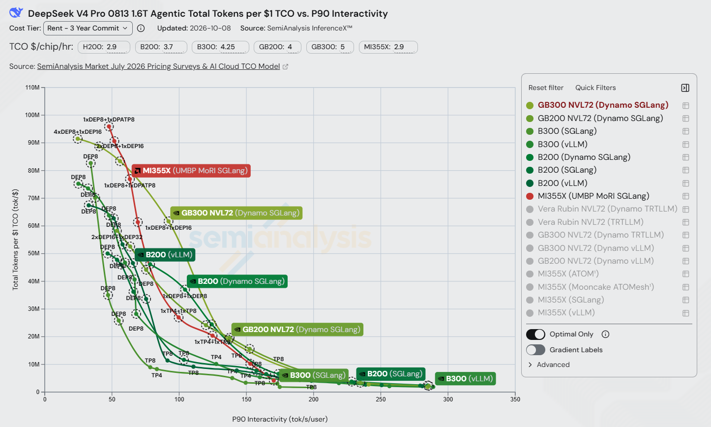
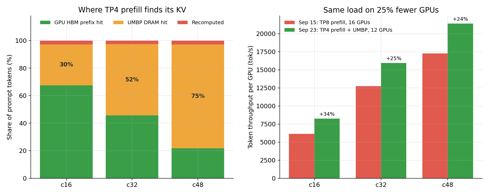
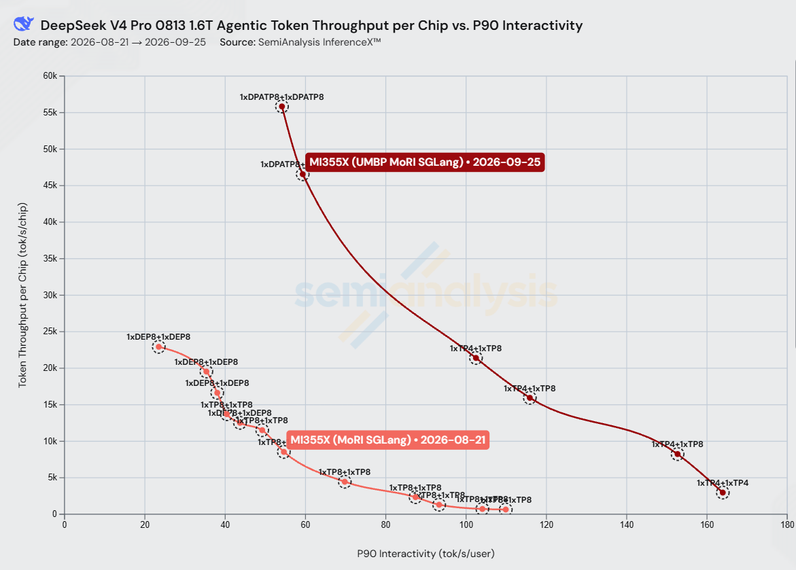

# UMBP 让 AMD Instinct™ MI355X 在公开权威的 AgentX 排行榜上击败 NVIDIA B200 Dynamo SGLang，取得 1.5 倍于对手的每美元 TCO 产出

*2026 年 9 月*

agentic（智能体）应用其多轮会话的特点使得服务成本极大取决于服务端能重用KV cache来避免重算。

我们今年 7 月与 Moonshot AI 联合发表的 [*Rebuilding Agentic AI from First Principles for AMD GPU*](https://www.amd.com/en/developer/resources/technical-articles/2026/rebuilding-agentic-ai-for-amd-gpu.html) 隆重推出了 **UMBP**（Unified Memory & Bandwidth Pool，统一内存与带宽池）。UMBP 是 AMD MoRI 团队从 agentic 场景出发、遵循第一性原理、专为 AMD 平台打造的 KV cache 基础设施，近一个月我们把这套成果贡献到 SGLang 社区，作为全新 KVCache Store Linker 的后端接入开源生态，让更广泛的生态用户都能受益。在 SemiAnalysis 的公开 AgentX 基准、DeepSeek-V4-Pro-0813 1.6T 模型上，AMD MI355X上通过MoRI disagg，配备 UMBP 做统一kvcache池， 叠加AMD一直以来在SGLang社区不断的优化， 达到 **峰值每 1 美元 TCO 产出 6900 万 token，而 B200 跑 Dynamo SGLang 是 4600 万 —— 每美元 token 产出领先 1.5×**（SemiAnalysis Rent / 三年承诺 成本档位，B200 为 $3.7/chip/hr，MI355X 为 $2.9/chip/hr，数据截至 2026-09-25）。

*图 1：DeepSeek-V4-Pro-0813 1.6T 在 agentic 场景下的「每 1 美元 TCO 总 token 数」vs.「P90 交互速度」，取自公开的 SemiAnalysis InferenceX dashboard（Rent / 三年承诺 档位，更新于 2026-09-25）。红色是 MI355X FP4 + UMBP + MoRI + SGLang；绿色系是 NVIDIA 阵营 —— B200、B300、H200、GB200、GB300 NVL72，以及一条 Vera Rubin NVL72 的预览曲线。越靠右上越好，标签是各点的并行布局。对比 B200 FP4（Dynamo SGLang），MI355X 的峰值是每 1 美元 TCO 6900 万 token，B200 为 4600 万。*

下面本文会详细讲 UMBP 如何做到这个结果。

## 快速回顾一下AgentX公开评测

AgentX 是 SemiAnalysis 用真实的 agentic 编程 trace 构建的公开基准，通过公开的 InferenceX 测试框架和 dashboard 运行。它正逐步成为智能体推理评估领域的重要行业标准，并已在全球范围内获得广泛采用，使用者包括 OpenAI、Meta、Inferact、RadixArk、MiniMax、阿里 Qwen、月之暗面、智谱 GLM、Oracle 等领先企业与团队。它的跑分口径、结果和 CI 全部公开，因此**本文里的每一个数字都可以被独立复核，包括被 NVIDIA 复核**。

AgentX 回放的是完整的智能体会话：每一轮把工具调用的结果追加到已积累的上下文里，再去问一次模型。这样产生的流量有四个特征，是聊天基准不会有的。

- **长时间、多轮会话** —— 每个会话大约 43 轮，整个生命周期约有 100 万 token 的上下文流量。
- **长输入、短输出** —— 每轮中位数 142K 输入 token，对应 444 输出 token。
- **大量前缀复用** —— 超过 96% 的 prompt token 是服务端已经见过的前缀的重复。
- **子智能体（subagent）和工具调用**，会把一个用户任务扇出成好几条共享前缀的并发会话。

它上报 TTFT、P90 交互速度（单用户 tok/s）、TPGS（每 GPU 秒总 token 数，含命中缓存的 token）和 TCO（每 token 的基础设施成本）—— 最后这个就是图 1 画的东西。

在 96% 前缀复用下，*决定 prefill 开销的是缓存管理*。另外，因为智能体要等完整回复，真正要紧的是端到端延迟、由 decode 主导。由此能看到面对AgentX，我们需要解决以下三个最重要的挑战：

- **KV 缓存装不进 HBM。** 同时跑着很多条长会话，再加上子智能体扇出，并发稍微一高，大部分可复用的 KV 早就被从显存里赶出去了。
- **KV 缓存并不是按 TP rank 切开的。** DeepSeek-V4 的稀疏注意力里，MLA latent 和 DSA indexer KV 在每个 rank 上都有一份完整副本。
- **缓存热度不是免费的。** host 缓存住在引擎进程里，引擎一重启就全部丢失，滚动升级同理。

## MoRI UMBP + SGLang KVCache Store Linker

为了解决上述挑战，我们开始重新审视之前UMBP碰到的问题，UMBP 是作为 **HiCache 的 L3 存储后端**接入SGLang。但在 AgentX 上我们有以下观察：

- **浪费了可共享的 DRAM。** 不可共享的 HiCache 占着 DRAM，而这些 DRAM 本可以给可共享的 L3 后端用，等于压缩了有效共享容量。
- **数据通路绕远。** HiCache 夹在 L1 HBM 和 L3 后端中间，既增加了 load/offload 开销，又堵死了 L1 ⇔ L3 的直连通路。
- **只能按 rank 本地管理。** HiCache 是嵌在每个 rank 里的，所有 KV 决策只基于本地信息，从全局看并不最优。
- **冗余复制。** 在 MLA + TP 下，每个 TP rank 都复制一份 KV cache，各自独立地 load/offload，白白浪费内存和 PCIe 带宽。
- **没有逐层流水。** HiCache 会把 L2→L1 的加载按层重叠起来，但从外部 L3 后端抓数据进 L2 这一段没有流水化 —— 必须全部完成，计算才能开始。
- **缓存跟着引擎一起死。** HiCache 活在引擎进程里，只要重启一次，host 侧缓存就全没了。

### KVCache Store Linker

我们向 SGLang maintainer 提了一个方案：干脆绕开 HiCache，在 L1 HBM 和外部 KV cache store 之间走一条直连数据通路 —— 结果发现这个方向和社区自己的规划高度一致。随后 MoRI 团队与 SGLang 社区共同设计了 **KVCache Store Linker**，把 UMBP 作为一等公民后端集成进去。linker 把 SGLang 的统一 radix tree 直接连到分布式 DRAM 池上；前缀命中时，prefill 直接从 DRAM 拉 KV page，而不是重算。

Linker + UMBP 把上面六个问题全部解决了：

- **DRAM 完全可共享**，跨 DP rank、跨模型实例都可共享 —— 从而支持 DP + round-robin 的部署方式（靠跨 DP rank 的 KV cache 共享）。
- **L1 ⇔ L3 直连通路**，中间零开销，单这一项就比 HiCache 路径把 TTFT 改善最多 13%。
- **全局 KV 管理** —— UMBP 基于全局信息做放置和淘汰，比按 rank 的本地策略更有效。
- **去重 + 按 rank 拆分 load/offload**，缓解内存和 PCIe 带宽压力。TP-N 的 prefill 现在对复制的 MLA/DSA KV 只存/取一份而不是 N 份，TP8 下 8 个 key 合成 1 个；这等于把 DRAM 有效容量翻了 N 倍，host 流量也按同样倍数下降。
- **逐层流水加载**，UMBP 通过批处理、层分组、ranged API，以及为 host→device KV 加载优化过的 GPU gather kernel，把逐层带来的额外请求开销藏了起来。
- **缓存能挺过引擎重启** —— 在 UMBP standalone 模式下，KV 池住在每节点一个的独立进程里，重启和升级之后可以直接复用，无需预热。

### 结果

在 AgentX agentic-coding 场景上端到端测量，用 UMBP linker 替换 HiCache：

| 并发 | 单卡吞吐 | P90 TTFT |
|---|---|---|
| 192 | **+14%** | **–66%**（35.3 秒 → 11.9 秒） |
| 256 | +9.7% | –51% |

TTFT 的下降来自在一个 96% 前缀复用的负载上**不再重算前缀**，没有任何 kernel 改动参与其中。

**缓存够大，拓扑就能改。** 有了这层去重的 DRAM 之后，prefill 不用单纯为了装下 KV 而硬上 TP8。在并发 16–48 时，我们 采用 **TP4 prefill + TP8 decode（12 卡）**，替代 TP8 + TP8（16 卡）。并发 16/32/48 时，UMBP 分别供上了 30%、52%、75% 的 prompt token，需要重算的不到 3%。用少 25% 的卡，单卡吞吐反而提升 24–34% —— 这正是图 1 里 TCO 差距的重要来源之一。

*图 2：左：在 UMBP linker 下，TP4 prefill 的每个 prompt token 的 KV 来自哪里 —— GPU HBM 前缀缓存、UMBP DRAM 层，还是重算。并发越高、HBM 驱逐越多，差额就由 DRAM 层补上。右：9 月 15 日 recipe（TP8 prefill + TP8 decode，16 卡）与 9 月 25 日 recipe（TP4 prefill + UMBP + TP8 decode，12 卡）的单卡吞吐对比。9 月 25 日的分支还包含乐观 prefill 和 SGLang v0.5.20 镜像；并发 16 另外用了 DSpark γ=6。*

代价是 prefill 变慢：prefill 的卡减半后，并发 16–48 的 P90 TTFT 上升 26–53%（2.2–3.6 秒 → 2.7–5.6 秒）。对于智能体要等完整回复、TTFT 只占其中一小部分的场景，我们愿意用这个代价，换在固定单用户 decode 速度下更高的单卡吞吐。

## 更多的优化

除此之外，AMD SGLang团队也在持续提供deepseek v4 pro的各项优化，具体包括以下几个方面。

- **FP4 稀疏注意力 indexer**（[sglang#37353](https://github.com/sgl-project/sglang/pull/37353)）。DeepSeek-V4 的 DSA indexer 要对每个 query token、在每一层给整段上下文打分，而且自带一份 per-token KV。把它跑在 gfx950 的 AITER FP4 kernel 上，这份 KV 从**每 token 132 B 降到 68 B** —— HBM 能装下更多并发序列，每步 decode 的 indexer 带宽更少，走 MoRI 链路的字节也更少。
- **乐观 prefill + 请求自持的投机 KV**（[sglang#38978](https://github.com/sgl-project/sglang/pull/38978)、[sglang#40111](https://github.com/sgl-project/sglang/pull/40111)）。在 PD 分离里，请求通常要等 decode 侧 bootstrap 完才能开始 prefill；高并发下这次握手纯粹就是排队时间。让 prefill 乐观地先开跑、投机 KV 归请求自己所有而不是挂在预留的 decode 槽位上，**并发 256 时 P90 TTFT 降低 27.7%**。再去掉 DSpark prefill 槽位扩展里的一次 host 同步，并发 128–256 的 P90 TTFT 又降了 **13–16%**。
- **MLA decode 的 per-stream split-K**（[sglang#39968](https://github.com/sgl-project/sglang/pull/39968)）：按 index stream 单独选 split-K 因子，而不是用一套配置去套 KV 长度相差好几个数量级的所有层。

*图 3：整轮优化中的单卡吞吐 vs. P90 交互速度。8 月 21 日基线在所有点上都用 16 卡（1P1D，TP8 + TP8）；优化后的 recipe 在不同并发下分别用 8、12 或 16 卡，吞吐按单卡归一化。*

## 总结

这轮工作有两个结果。

**一是横向对比 NVIDIA B200。** 在 AgentX 公开榜上，MI355X 的每美元 token 峰值产出是 B200 的 **1.5 倍**：

| 每 1 美元 TCO 的 token 峰值产出 | |
|---|---|
| MI355X（UMBP + MoRI + SGLang） | **6900 万** |
| B200（Dynamo SGLang） | 4600 万 |

**二是纵向对比我们自己一个月前。** 同一套基准、同样并发 192：

| 指标 | 8 月 21 日 | 9 月 25 日 | 变化 |
|---|---|---|---|
| 单卡吞吐 | 22.9k tok/s | 46.6k tok/s | **2.03×** |
| P90 TTFT | 33.6 s | 11.8 s | **–65%** |
| P90 交互速度 | 23.5 tok/s/用户 | 59.3 tok/s/用户 | **2.5×** |

单卡吞吐的峰值也从 22.9k 涨到 55.8k（**2.4×**），出现在并发 256。

在 agentic 负载里，96% 的 prompt token 都是算过的，所以真正决定每 token 成本的，是那个管理「这些 token 存放在哪里」的系统。UMBP 就是这个系统：它把 DRAM 变成一层去重、可跨实例共享、并且能挺过引擎重启的 KV 池，再通过 KVCache Store Linker 直接接进 SGLang 的 radix tree。

7 月那篇文章的路线图里，第一项是完成 UMBP 的集成，现在已经交付；下一项是把 UMBP 带进 vLLM 生态。

## 致谢

感谢 SGLang 社区的设计评审和快速合入，感谢 SemiAnalysis 提供 AgentX 基准和 InferenceX CI 基础设施，以及 AMD AITER、MoRI 和 ROCm 团队。

## 参考

1. SemiAnalysis — AgentX 基准与 InferenceX dashboard. https://inferencex.semianalysis.com
2. vLLM — AgentX. https://vllm.ai/blog/2026-09-08-vllm-agentx
3. AMD — Rebuilding Agentic AI from First Principles for AMD GPU，与 Moonshot AI 合作（“What is UMBP”）. https://www.amd.com/en/developer/resources/technical-articles/2026/rebuilding-agentic-ai-for-amd-gpu.html
