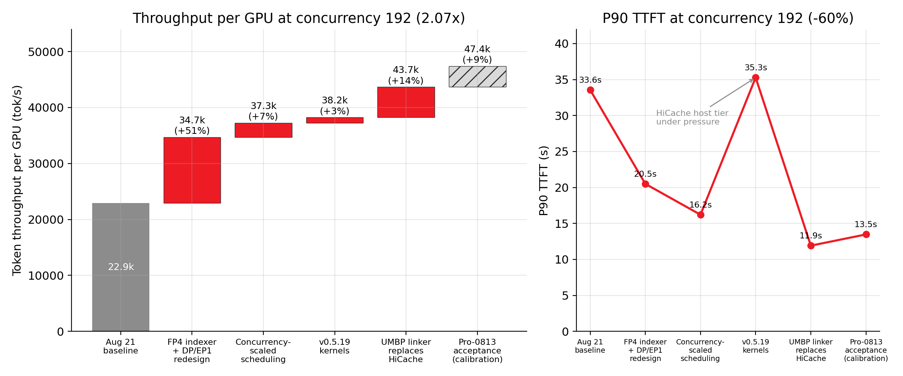

 # Doubling DeepSeek-V4 Agentic Throughput on AMD Instinct™ MI355X with Prefill-Decode Disaggregation

*September 2026*

Agentic coding workloads have become one of the hardest things to serve. A single task can run dozens of turns, and each turn resends a long, mostly unchanged context. The agent also waits on every token before it can take its next step. For a model the size of DeepSeek-V4-Pro, this pushes the serving stack in three directions at once. The KV cache has to live somewhere larger than HBM. Prefill has to reuse that cache instead of recomputing it. Decode has to stay fast while the batch grows.

In late August 2026, DeepSeek-V4-Pro FP4 on AMD Instinct™ MI355X with SGLang prefill-decode (PD) disaggregation reached **22.9k tokens/s per GPU at concurrency 192**, with a P90 time-per-output-token (TPOT) of **42.7 ms**. We then spent about five weeks optimizing across kernels, the scheduler, KV transport and KV storage. The same InferenceX agentic-coding benchmark now reaches **46.6k tokens/s per GPU at concurrency 192 with a 16.9 ms P90 TPOT**. At concurrency 256 it peaks at **55.8k tokens/s per GPU**.

This post walks through the five AMD-developed features behind that gain. For each one we cover the problem it addresses, how it works, and what we measured. All of the work is upstream in SGLang, AITER and MoRI, or in the public InferenceX recipes.

## TL;DR

- **Up to 2.4× throughput per GPU.** At concurrency 192, throughput per GPU rose 2.03×, P90 TPOT fell 60%, P90 TTFT fell 65%, and per-user P90 interactivity rose 2.5× (23.5 → 59.3 tok/s/user). All numbers compare Aug 21 with Sep 23 on the same benchmark.
- **FP4 sparse-attention indexer.** The DeepSeek-V4 sparse-attention indexer now runs on AITER FP4 kernels on gfx950. This cuts per-token indexer KV from 132 B to 68 B.
- **DP-attention redesign for PD disaggregation.** We moved to TP-sharded MoE (EP1) behind DP attention and gated the tuning knobs by role. Concurrency-scaled scheduling is part of the same change. With the FP4 indexer, this delivered **+62% at concurrency 192** and halved P90 TTFT.
- **MoRI UMBP direct linker.** It adds a DRAM tier for the KV cache that plugs straight into SGLang's radix tree. It deduplicates the MLA/DSA KV that DeepSeek-V4 replicates across TP ranks. It replaced HiCache for **+14% throughput and –66% P90 TTFT at concurrency 192**. It also lets a TP4 prefill do the work of a TP8 prefill, **raising throughput per GPU by 24–34% on 25% fewer GPUs**.
- **Optimistic prefill with request-owned speculative KV.** Prefill starts before decode has finished bootstrapping instead of waiting for it. Together with removing a host sync from DSpark prefill, this cuts P90 TTFT by **13–28%** at high concurrency.

*Figure 1: Throughput per GPU vs. P90 interactivity for DeepSeek-V4-Pro FP4 agentic coding on MI355X with SGLang PD disaggregation over MoRI. Points further up and to the right are better. Labels show benchmark concurrency. The Aug 21 baseline uses 16 GPUs (1P1D, TP8 + TP8) at every point. The optimized recipes pick 8, 12 or 16 GPUs for each concurrency and report throughput normalized per GPU.*

## What Agentic DeepSeek-V4 Serving Demands

Chat-style serving benchmarks rest on assumptions that agentic traffic does not satisfy. DeepSeek-V4's architecture adds a few more.

| Characteristic | Assumption it breaks |
|---|---|
| Multi-turn sessions that resend a growing shared prefix | "Prefill is mostly new tokens." In practice most prompt tokens are cache hits, *if* the cache is still there. |
| Working set of many long sessions | "The KV cache fits in HBM." At moderate concurrency, most reusable KV has already been evicted from GPU memory. |
| Agent blocks on the full response before its next step | "TTFT is the latency that matters." End-to-end P90 latency, which is dominated by decode speed, sets the agent's pace. |
| DeepSeek-V4 sparse attention (a DSA indexer plus MLA latent KV) | "The KV cache is sharded across TP ranks." The MLA latent and indexer KV are *replicated* on every rank. |
| Heavily compressed attention (HCA) layers, compress ratio 128 | "One split-K setting fits every attention layer." KV lengths vary widely across layers and requests. |

## The Serving Stack

All results use SGLang PD disaggregation on MI355X: prefill and decode run on separate nodes, and KV moves between them over RDMA.

| Layer | Component | Role in this work |
|---|---|---|
| Serving | SGLang (ROCm builds v0.5.17 → v0.5.20) | PD disaggregation, DP attention, MTP/DSpark speculative decoding |
| Kernels | AITER | FP4 MoE GEMMs, FP4 sparse-attention indexer, MLA decode |
| KV transport | MoRI-IO | Prefill→decode KV transfer over RDMA |
| KV storage | MoRI UMBP (Unified Memory & Bandwidth Pool) | Distributed DRAM tier for the prefix cache, attached to SGLang's radix tree |
| Platform | ROCm 7.2, AMD Instinct MI355X | 8 GPUs per node, FP4 weights |

The benchmark is the InferenceX `agentic-coding` scenario with DRAM KV offload enabled (`dram-utilization: 0.80`). It runs as part of InferenceX CI.

## Key Optimizations

### 1. FP4 Sparse-Attention Indexer on MI355X

**Motivation.** DeepSeek-V4 uses DeepSeek Sparse Attention. For every query token, a lightweight *indexer* scores the whole context and chooses which KV entries the main MLA attention reads. The indexer has its own per-token KV cache, and it runs on every token at every layer. At agentic context lengths it therefore costs a meaningful share of both HBM capacity and decode time. It also counts double in disaggregation, because its KV has to cross the network from prefill to decode.

**Mechanism.** [sgl-project/sglang#37353](https://github.com/sgl-project/sglang/pull/37353) enables an FP4 indexer path for DeepSeek-V4 on gfx950, backed by AITER kernels. Indexer keys are stored and scored in FP4 instead of FP8. This cuts per-token indexer KV from **132 B to 68 B**. The recipe enables it with `--enable-deepseek-v4-fp4-indexer`.

**Result.** Smaller indexer KV means more concurrent sequences fit in HBM, less indexer bandwidth per decode step, and fewer bytes on the MoRI link. We measured it together with the DP-attention redesign below, since the two shipped in the same recipe update (Figure 2).

### 2. Redesigning DP Attention for PD Disaggregation

**Motivation.** The August recipe used a hybrid layout. Low concurrency ran TP8 without data-parallel attention. Concurrency 64–192 ran DP attention with EP8 expert parallelism, and the same environment knobs applied to both prefill and decode. At concurrency 192 this reached 22.9k tok/s/GPU, but P90 TTFT was 33.6 s. Requests spent most of their time queued.

**Mechanism.** The redesign landed in [InferenceX #2823](https://github.com/SemiAnalysisAI/InferenceX/pull/2823). It rethought how DP attention and MoE share a single 8-GPU MI355X node:

- **TP-sharded MoE (EP1) behind DP attention.** Attention runs data-parallel across 8 ranks, while expert weights are TP-sharded instead of distributed by EP8. This takes all-to-all dispatch and combine, and the expert-routing load imbalance that comes with it, off the critical path. Shared-expert fusion (`--enforce-shared-experts-fusion`) folds the shared expert into the routed-expert GEMM.
- **Role-gated tuning.** DP-specific knobs apply only to the roles (prefill or decode) that actually run DP attention. Non-DP roles use `GPU_MAX_HW_QUEUES=2`. The recipe also sets `SGLANG_MORI_RECV_BOUND=1` for the MoRI receive path and enables AITER batched GEMM.
- **Concurrency-scaled scheduling.** `max-running-requests` now scales with benchmark concurrency (2× concurrency) instead of using a fixed cap. The DP arms also get a larger static memory fraction (0.92) and a chunked-prefill size that scales with TP (8192 × TP). Two-batch overlap is turned off.

**Result.** In a controlled step-by-step sweep at concurrency 192 with 16 GPUs throughout, the first step raised throughput per GPU **from 22.9k to 34.7k (+51%)**. That step bundled the FP4 indexer, the EP1 redesign and the SGLang v0.5.18 image. Concurrency-scaled scheduling then added another **+7% (37.3k)**. Across the two steps, P90 TTFT fell from **33.6 s to 16.2 s**.

*Figure 2: Step-by-step attribution at concurrency 192 on a fixed 16-GPU 1P1D TP8/DP8 topology. Each bar adds one change to the one before it. Left: throughput per GPU. Right: P90 TTFT. The TTFT spike at the "v0.5.19 kernels" step is the HiCache host tier running out of room (GPU KV usage 94%); the UMBP linker removes it in the next step. The hatched bar is an update to the speculative-decoding acceptance calibration for the DeepSeek-V4-Pro-0813 checkpoint, not a software optimization (see "How to read the numbers").*

### 3. MoRI UMBP: A Deduplicated DRAM KV Tier Wired into the Radix Tree

**Motivation.** In agentic traffic, the fastest prefill is the one you skip. Once many sessions are active at the same time, though, their shared prefixes no longer fit in HBM. They get evicted and then recomputed on the next turn. SGLang's HiCache adds a host-memory tier, but at high concurrency it came under pressure: in the step before UMBP, P90 TTFT at concurrency 192 jumped to 35.3 s. DeepSeek-V4 also makes host offload wasteful by default. The MLA latent and DSA indexer KV are replicated on every TP rank, so a TP8 prefill offloads the same bytes eight times.

**Mechanism.** UMBP (Unified Memory & Bandwidth Pool) is the tiered KV storage component of AMD's MoRI library; see "What is UMBP" in [*Rebuilding Agentic AI from First Principles for AMD GPU*](https://www.amd.com/en/developer/resources/technical-articles/2026/rebuilding-agentic-ai-for-amd-gpu.html) for its design. The **UMBP direct linker** connects SGLang's unified radix tree straight to a distributed DRAM pool, without going through HiCache. On a prefix match, prefill pulls KV pages from DRAM instead of recomputing them. [sgl-project/sglang#38778](https://github.com/sgl-project/sglang/pull/38778) adds **replica-aware key deduplication** for the replicated MLA/DSA KV. A TP-N prefill now stores and fetches one copy instead of N; at TP8, eight keys become one. That multiplies the effective DRAM capacity and cuts host traffic by the same factor.

**Result.** At concurrency 128–256, replacing HiCache with the UMBP linker raised throughput per GPU by **14% at concurrency 192** and 9.7% at concurrency 256. P90 TTFT fell **66% (35.3 s → 11.9 s) at concurrency 192** and 51% at concurrency 256.

With a large, deduplicated DRAM tier in place, prefill no longer needs TP8 simply to hold KV. At concurrency 16–48 the September 23 recipe uses a **TP4 prefill with a TP8 decode (12 GPUs)** instead of TP8 + TP8 (16 GPUs). UMBP serves 30%, 52% and 75% of prompt tokens at concurrency 16, 32 and 48, while less than 3% are recomputed. Throughput per GPU rises 24–34% (Figure 3).

*Figure 3: Left: where the TP4 prefill finds the KV for each prompt token under the UMBP linker: GPU HBM prefix cache, UMBP DRAM tier, or recomputation. As concurrency grows and HBM evicts more, the DRAM tier absorbs the difference. Right: throughput per GPU of the Sep 15 recipe (TP8 prefill + TP8 decode, 16 GPUs) vs. the Sep 23 recipe (TP4 prefill + UMBP + TP8 decode, 12 GPUs). The Sep 23 arms also include optimistic prefill and the SGLang v0.5.20 image; concurrency 16 additionally uses DSpark γ=6.*

The trade-off is prefill time. With half the prefill GPUs, P90 TTFT at concurrency 16–48 rises by 26–53% (2.2–3.6 s → 2.7–5.6 s). For agentic workloads, where the agent waits for the full response, we accept that in exchange for more throughput per GPU and a fixed per-user decode speed.

### 4. Optimistic Prefill with Request-Owned Speculative KV

**Motivation.** In PD disaggregation, a request cannot start prefill until the decode side has *bootstrapped* it, meaning decode has reserved KV slots for it and returned their addresses. At high concurrency, decode is busy, and this handshake shows up as queueing time in TTFT. Speculative decoding makes the problem worse. The draft model's KV (for MTP or DSpark) needs its own slots, and the prefill-side slot expansion for DSpark forced a host synchronization.

**Mechanism.** [sgl-project/sglang#38978](https://github.com/sgl-project/sglang/pull/38978) lets prefill **start optimistically** before the decode bootstrap completes. The speculative KV is owned by the request rather than by a pre-reserved decode slot, so prefill can compute it and transfer it once decode is ready. If the attempt fails, the request falls back to the normal path. The recipe enables it with `--optimistic-prefill-attempts 2` on every UMBP-linker arm. [sgl-project/sglang#40111](https://github.com/sgl-project/sglang/pull/40111) removes the host sync from DSpark prefill slot expansion, so prefill batches no longer stall the CPU scheduler.

**Result.** Both PRs were measured on MI355X with 1P1D TP8/DP8:
- Optimistic prefill at concurrency 256 cut **P90 TTFT by 27.7%** and mean TTFT by 22.4%, and raised throughput per GPU by 5.7%.
- Removing the DSpark host sync cut **P90 TTFT by 15.3%, 13.1% and 15.5%** at concurrency 128, 192 and 256. Throughput rose 0.9–2.7%.

## How to Read the Numbers

We aim for these results to be reproducible and fairly attributed:

- **Speculative decoding acceptance is simulated.** InferenceX fixes the acceptance length (AL) at a reference value for each checkpoint (`SGLANG_SIMULATE_ACC_LEN`), so every run is compared at the same acceptance. The move to the DeepSeek-V4-Pro-0813 checkpoint raised the reference AL from 2.49 to 3.01 (MTP-3 / DSpark γ=3). That accounts for **about 9% of the throughput gain at concurrency 192**, shown as the hatched bar in Figure 2. The Sep 23 recipe runs DSpark γ=6 (AL 3.77) at concurrency 4 and 16.
- **GPU counts differ between recipes.** The Aug 21 baseline uses 16 GPUs at every concurrency. The optimized recipes use 8 GPUs at concurrency 4, 12 at concurrency 16–48, and 16 at concurrency 128 and above. All throughput is reported per GPU.
- **Some features are measured in bundles.** Where a recipe update combined several features with an image upgrade (step 1 in Figure 2), we report the combined gain rather than guessing a split. Numbers for optimistic prefill, the DSpark host-sync fix and HCA split-K come from the A/B measurements in their upstream PRs.
- **Run-to-run variance.** Rerunning the same configuration moved throughput by ±2% at most points (up to 11% at concurrency 48).

## Summary

| Metric | Aug 21 | Sep 23 | Change |
|---|---|---|---|
| Throughput/GPU, concurrency 192 | 22.9k tok/s | 46.6k tok/s | **2.03×** |
| P90 TPOT, concurrency 192 | 42.7 ms | 16.9 ms | **–60%** |
| P90 TTFT, concurrency 192 | 33.6 s | 11.8 s | **–65%** |
| P90 interactivity, concurrency 192 | 23.5 tok/s/user | 59.3 tok/s/user | **2.5×** |
| Peak throughput/GPU | 22.9k (c192) | 55.8k (c256) | **2.4×** |
| Throughput/GPU, concurrency 48 | 11.5k tok/s | 21.4k tok/s | **1.86×** |
| Throughput/GPU, concurrency 4 | 1.3k tok/s | 3.0k tok/s | **2.27×** |

Doubling DeepSeek-V4 agentic throughput on MI355X did not depend on one breakthrough. It came from following the bottleneck through the stack. Leaner FP4 indexer KV and a DP-attention layout suited to a single MI355X node addressed decode first. As prefix reuse became the limit, MoRI UMBP turned host DRAM into a deduplicated extension of the radix tree. With the cache in place, the remaining TTFT was mostly bootstrap and host-sync overhead, and optimistic prefill removed it. Per-stream split-K then improved the MLA decode kernel itself. Every piece is upstream and runs in public InferenceX CI, so anyone can reproduce the curve in Figure 1.

## Acknowledgements

We thank the SGLang community for design reviews and fast upstreaming, SemiAnalysis for the InferenceX benchmark and CI infrastructure, and the AMD AITER, MoRI and ROCm teams. 

## References

1. sgl-project/sglang#37353 — [AMD] Enable FP4 indexer for DeepSeek V4. https://github.com/sgl-project/sglang/pull/37353
2. SemiAnalysisAI/InferenceX#2823 — DeepSeek-V4 MI355X agentic PD-disaggregation recipe update. https://github.com/SemiAnalysisAI/InferenceX/pull/2823
3. sgl-project/sglang#38778 — [Unified Cache] Dedup replicated MLA/DSA KV in the UMBP direct linker. https://github.com/sgl-project/sglang/pull/38778
4. sgl-project/sglang#38978 — Reduce decode bootstrap latency with request-owned speculative KV. https://github.com/sgl-project/sglang/pull/38978
5. sgl-project/sglang#40111 — Avoid host sync in DSpark prefill slot expansion. https://github.com/sgl-project/sglang/pull/40111
6. sgl-project/sglang#39968 — [AMD] dsv4: pick kv_splits per index stream. https://github.com/sgl-project/sglang/pull/39968
7. SemiAnalysisAI/InferenceX#3256 — DeepSeek-V4 MI355X UMBP + DSpark recipe. https://github.com/SemiAnalysisAI/InferenceX/pull/3256
8. InferenceX dashboard. https://inferencex.semianalysis.com
9. AMD — Rebuilding Agentic AI from First Principles for AMD GPU - Together with Moonshot AI ("What is UMBP"). https://www.amd.com/en/developer/resources/technical-articles/2026/rebuilding-agentic-ai-for-amd-gpu.html

