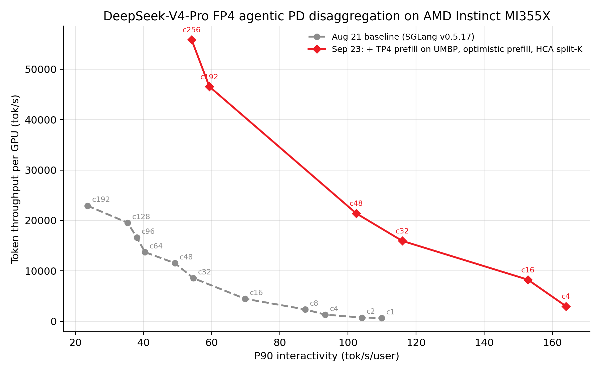

# UMBP Empowers AMD Instinct™ MI355X to Beat NVIDIA B200 Dynamo SGLang on the Public AgentX Leaderboard, at 1.5× the Token-per-Dollar TCO

*September 2026*

An agentic coding session runs for dozens of turns, and every turn resends a context that is almost entirely unchanged from the last one. More than 96% of the prompt tokens an agent sends have already been computed. **The cost of serving this workload is therefore set by how much of that KV cache the server can find again and reuse.**

MoRI **UMBP** (Unified Memory & Bandwidth Pool) is built to keep that cache findable. UMBP is a KV cache infrastructure built by the AMD MoRI team from first principles, starting from the agentic workload itself and purpose-built for the AMD platform. We have contributed that work back to the SGLang community, where it lands in the open-source ecosystem as the backend behind the new KVCache Store Linker — so the whole community benefits, not only AMD deployments. On the SemiAnalysis AgentX benchmark with DeepSeek-V4-Pro-0813 1.6T, MI355X running UMBP + MoRI + SGLang delivers **69M total tokens per $1 TCO at its peak, against 46M for B200 running Dynamo SGLang — a 1.5× advantage in tokens per dollar** (SemiAnalysis Rent / 3-Year-Commit cost tier, B200 at $3.7/chip/hr and MI355X at $2.9/chip/hr, as of 2026-09-25).

*Figure 1: DeepSeek-V4-Pro-0813 1.6T agentic total tokens per $1 TCO vs. P90 interactivity, from the public SemiAnalysis InferenceX dashboard (Rent / 3-Year-Commit tier, updated 2026-09-25). Red is MI355X FP4 with UMBP + MoRI + SGLang; the green curves are the NVIDIA field — B200, B300, H200, GB200 and GB300 NVL72, plus a Vera Rubin NVL72 preview. Up and to the right is better; labels show the parallelism layout of each point. Against B200 FP4 (Dynamo SGLang), MI355X peaks at 69M tokens per $1 TCO vs. 46M.*

Readers of [*Rebuilding Agentic AI from First Principles for AMD GPU*](https://www.amd.com/en/developer/resources/technical-articles/2026/rebuilding-agentic-ai-for-amd-gpu.html), which we published with Moonshot AI in July, will recognize the argument: *the decisive resource in agentic serving is the KV cache* — how much of the reuse roofline you capture, where the cache lives once it spills out of HBM, and whether the scheduler can route to it faster than recomputing it. That post introduced UMBP as the answer and measured a 3.2× smaller P99 TTFT at essentially unchanged cumulative hit rate.

**This post measures that same stack against NVIDIA B200**, on a public third-party leaderboard.

What follows is how UMBP produces that result. The rest of the recipe — FP4 indexer, the DP-attention redesign, optimistic prefill — is summarized in one section near the end: all of it matters, but UMBP is what moves the TCO curve the furthest.

## What AgentX Is, and What It Measures

AgentX is a public benchmark built by SemiAnalysis from real-world agentic coding traces, served through the public InferenceX harness and dashboard. It is fast becoming an industry standard for agentic inference evaluation, adopted worldwide by leading teams including OpenAI, Meta, Inferact, RadixArk, MiniMax, Alibaba Qwen, Moonshot AI, Zhipu GLM and Oracle. Its methodology, results and CI are all public, so **every number in this post can be checked independently, including by NVIDIA.**

AgentX replays whole agent sessions: each turn appends tool results to the accumulated context and re-queries the model. That traffic has four properties chat benchmarks do not produce.

- **Long-running, multi-turn sessions** — roughly 43 turns per session, around 1M tokens of context traffic over a session's life.
- **Long contexts, short outputs** — median 142K input tokens against 444 output tokens per turn.
- **Extensive prefix reuse** — above 96% of prompt tokens are repeats of a prefix the server has already seen.
- **Subagents and tool calls**, which fan a single user task out into several concurrent sessions sharing a prefix.

It reports TTFT, P90 interactivity (per-user tok/s), TPGS (total tokens per GPU-second, counting cached tokens), and TCO (infrastructure cost per token) — the last of which is what Figure 1 plots.

Two consequences. At 96% prefix reuse, *cache management determines prefill cost*. And because the agent blocks on the full response, the latency that matters is end-to-end, dominated by decode — so spending more of the machine on prefill does not buy headroom. The prefill work has to be eliminated instead.

## What the Workload Breaks, and What We Built to Match It

The July post tabulated the chat-era assumptions that agentic traffic invalidates. Three of those rows are the ones this stack had to answer:

| Characteristic | Assumption it breaks |
|---|---|
| Working set of many long sessions, plus subagents | "The KV cache fits in HBM." At moderate concurrency, most reusable KV has already been evicted from GPU memory. |
| DeepSeek-V4 sparse attention (a DSA indexer plus MLA latent KV) | "The KV cache is sharded across TP ranks." The MLA latent and indexer KV are *replicated* on every rank. |
| Engine restarts and rolling upgrades | "Cache warmth is free." A host cache that lives inside the engine process dies with it. |

Each row dictates a layer of the stack. All results use SGLang PD disaggregation on MI355X: prefill and decode run on separate nodes, and KV moves between them over RDMA.

| Layer | Component | Role in this work |
|---|---|---|
| Serving | SGLang (ROCm builds v0.5.17 → v0.5.20) | PD disaggregation, DP attention, MTP/DSpark speculative decoding |
| KV storage | **MoRI UMBP** | Distributed, deduplicated DRAM KV pool, attached to SGLang's radix tree through the KVCache Store Linker |
| KV transport | MoRI-IO | Prefill→decode KV transfer over RDMA |
| Kernels | AITER | FP4 MoE GEMMs, FP4 sparse-attention indexer, MLA decode |
| Platform | ROCm 7.2, AMD Instinct MI355X | 8 GPUs per node, FP4 weights |

The benchmark is the InferenceX `agentic-coding` scenario with DRAM KV offload enabled (`dram-utilization: 0.80`). It runs as part of InferenceX CI.

## MoRI UMBP + the SGLang KVCache Store Linker

UMBP's design is laid out in the "What is UMBP" section of the July post: a single logical cache spanning engine HBM → host DRAM → the UMBP DRAM pool → SSD, built on three principles — **agentic-inference-native design, scheduler/framework/orchestrator co-design, and AMD hardware affinity**. All three serve one goal: an offloaded prefix stays *routable*, so the router can use placement and fetch-cost information to select the replica that will return it fastest.

This section covers what we found when we ran that design behind a production inference engine at high concurrency: the integration path itself had become the bottleneck.

### What we found wrong with the HiCache path

In the July post, UMBP was integrated into SGLang the way the framework offered: as a **HiCache L3 storage backend**, registered as `mori` and selected with `--hicache-storage-backend mori`. That integration works, and it produced the numbers quoted above. At higher concurrency on AgentX it fell short of what the hardware allows, and the limit was in the HiCache tier between UMBP and the engine. Six problems, all structural:

- **Wasted shareable DRAM.** Unsharable HiCache occupies DRAM that could otherwise serve the shareable L3 backend, shrinking effective shareable capacity.
- **Indirect data path.** Sitting between L1 HBM and the L3 backend, HiCache adds load/offload overhead and blocks a direct L1 ⇔ L3 data path.
- **Per-rank local management.** HiCache is embedded per rank and makes all KV decisions on local information only, which is globally suboptimal.
- **Redundant replication.** Under MLA + TP, each TP rank replicates the KV cache and loads/offloads independently, wasting memory and PCIe bandwidth.
- **No layer-wise pipelining.** HiCache overlaps its L2→L1 load layer by layer, but the fetch from the external L3 backend into L2 is not pipelined — it must complete before compute starts.
- **Cache dies with the engine.** HiCache lives in the engine process, so any restart discards the host-side cache.

This showed up directly in the benchmark. In the recipe step just before UMBP, P90 TTFT at concurrency 192 jumped to 35.3 s with GPU KV usage pinned at 94%: the host tier had run out of room and requests were queueing behind recomputation.

### The KVCache Store Linker

We proposed to the SGLang maintainers an option to bypass HiCache entirely with a direct data path between L1 HBM and external KV cache stores — a direction that turned out to align closely with the community's own plans. The MoRI team then co-designed the **KVCache Store Linker** with the SGLang community, integrating UMBP as a first-class backend. The linker connects SGLang's unified radix tree straight to the distributed DRAM pool. On a prefix match, prefill pulls KV pages from DRAM instead of recomputing them.

Linker + UMBP resolves all six issues above:

- **Fully shareable DRAM** across DP ranks and model instances — enabling DP + round-robin deployments via cross-DP-rank KV cache sharing.
- **Direct L1 ⇔ L3 path** with no intermediate overhead, improving TTFT by up to 13% over the HiCache path on its own.
- **Global KV management** — UMBP places and evicts KV based on global information, more effective than per-rank local policies.
- **Deduplication + split load/offload by rank**, alleviating memory and PCIe bandwidth pressure. A TP-N prefill now stores and fetches one copy of the replicated MLA/DSA KV instead of N; at TP8, eight keys become one. That multiplies effective DRAM capacity and cuts host traffic by the same factor.
- **Layer-wise pipelined loading**, with UMBP hiding the added per-layer request overhead via batching, layer grouping, a ranged API, and an optimized GPU gather kernel for host-to-device KV loading.
- **Cache survives engine restarts** — in UMBP standalone mode the KV pool lives in a separate per-node process, so restarts and upgrades reuse it with no warm-up.

### Results

Replacing HiCache with the UMBP linker, measured end-to-end on the AgentX agentic-coding scenario:

| Concurrency | Throughput/GPU | P90 TTFT |
|---|---|---|
| 192 | **+14%** | **–66%** (35.3 s → 11.9 s) |
| 256 | +9.7% | –51% |

The TTFT reduction comes from eliminating prefix recomputation on a workload with 96% prefix reuse. No kernel changed.

**A large enough cache changes the topology.** Once the deduplicated DRAM tier is in place, prefill no longer needs TP8 simply to hold KV. At concurrency 16–48 the September 23 recipe runs a **TP4 prefill with a TP8 decode (12 GPUs)** instead of TP8 + TP8 (16 GPUs). UMBP serves 30%, 52% and 75% of prompt tokens at concurrency 16, 32 and 48, while less than 3% are recomputed. Throughput per GPU rises 24–34% on 25% fewer GPUs — which is the mechanism behind a good part of the TCO gap in Figure 1.

*Figure 2: Left: where the TP4 prefill finds the KV for each prompt token under the UMBP linker — GPU HBM prefix cache, UMBP DRAM tier, or recomputation. As concurrency grows and HBM evicts more, the DRAM tier absorbs the difference. Right: throughput per GPU of the Sep 15 recipe (TP8 prefill + TP8 decode, 16 GPUs) vs. the Sep 23 recipe (TP4 prefill + UMBP + TP8 decode, 12 GPUs). The Sep 23 arms also include optimistic prefill and the SGLang v0.5.20 image; concurrency 16 additionally uses DSpark γ=6.*

The trade-off is prefill time. With half the prefill GPUs, P90 TTFT at concurrency 16–48 rises by 26–53% (2.2–3.6 s → 2.7–5.6 s). For agentic workloads, where the agent waits for the full response and TTFT is a small fraction of it, we take that trade for more throughput per GPU at a fixed per-user decode speed.

### Upstream

The linker and the surrounding KV cache infrastructure are being built in the open with the SGLang community:

**KVCache Store Linker** — optional external-cache linker mode for the Unified Radix Cache (`hzh0425`); UMBP external linker, [#37578](https://github.com/sgl-project/sglang/pull/37578) (`maning00`); dedup of replicated MLA/DSA KV in the UMBP direct linker, [#38778](https://github.com/sgl-project/sglang/pull/38778) (`TianDi101`); graceful handling of external-linker KV load failure instead of crashing the scheduler (`TianDi101`); hybrid-Mamba support in the external-cache linker (`isytwu`).

**KVCache Indexer** — process-local in-memory KV indexer with Router integration (`wuyl1`); `component_types` on `BlockStored` for per-component placement tracking.

**Scheduler & Router** — bucket-aware policy domains and native cache indexing (`Bo-Vincent`); composable scoring and eligibility policies, [#37731](https://github.com/sgl-project/sglang/pull/37731) (`Bo-Vincent`).

## Everything Else, Briefly

Three other AMD-developed changes shipped into the same MI355X recipe between Aug 21 and Sep 23; together with UMBP they doubled throughput per GPU (see Summary).

- **FP4 sparse-attention indexer** ([sglang#37353](https://github.com/sgl-project/sglang/pull/37353)). DeepSeek-V4's DSA indexer scores the whole context for every query token at every layer, and carries its own per-token KV. Running it on AITER FP4 kernels on gfx950 cuts that KV from **132 B to 68 B per token** — more concurrent sequences in HBM, less indexer bandwidth per decode step, and fewer bytes over the MoRI link.
- **DP attention redesigned for PD disaggregation** ([InferenceX#2823](https://github.com/SemiAnalysisAI/InferenceX/pull/2823)). Attention runs data-parallel across 8 ranks while expert weights are **TP-sharded (EP1)** rather than distributed by EP8, which takes all-to-all dispatch/combine and expert-routing imbalance off the critical path. Tuning knobs are gated by role (prefill vs. decode), and `max-running-requests` scales with benchmark concurrency instead of a fixed cap. Bundled with the FP4 indexer and the v0.5.18 image, this was **+51% throughput per GPU at concurrency 192**; concurrency-scaled scheduling added another **+7%**, and P90 TTFT fell from 33.6 s to 16.2 s.
- **Optimistic prefill with request-owned speculative KV** ([sglang#38978](https://github.com/sgl-project/sglang/pull/38978), [sglang#40111](https://github.com/sgl-project/sglang/pull/40111)). In PD disaggregation a request normally waits for decode to bootstrap it before prefill can start; at high concurrency that handshake is pure queueing time. Letting prefill start optimistically, with the speculative KV owned by the request rather than a pre-reserved decode slot, cut **P90 TTFT by 27.7% at concurrency 256**. Removing a host sync from DSpark prefill slot expansion cut P90 TTFT a further **13–16%** at concurrency 128–256.
- **Per-stream split-K for MLA decode** ([sglang#39968](https://github.com/sgl-project/sglang/pull/39968)) picks `kv_splits` per index stream instead of applying one setting to layers whose KV lengths differ by orders of magnitude.

*Figure 3: Throughput per GPU vs. P90 interactivity across the optimization campaign. The Aug 21 baseline uses 16 GPUs (1P1D, TP8 + TP8) at every point; the optimized recipes pick 8, 12 or 16 GPUs per concurrency and report throughput normalized per GPU.*

## How to Read the Numbers

We aim for these results to be reproducible and fairly attributed:

- **TCO comparison basis.** Figure 1 is the public InferenceX dashboard, Rent / 3-Year-Commit cost tier, at $3.7/chip/hr for B200 and $2.9/chip/hr for MI355X, updated 2026-09-25. The 1.5× figure compares peak tokens per $1 TCO: 69M for MI355X against 46M for B200. At matched interactivity in the mid-range the advantage is smaller, and at the high-interactivity end the B200 curve is ahead. Pick the comparison point that matches your own serving target.
- **The comparison is against B200.** Figure 1 also plots B300, GB200, GB300 NVL72 and a Vera Rubin NVL72 preview, some of which sit above the MI355X curve. Those are newer or larger-system parts at higher TCO per chip ($4.25–$8.5/chip/hr vs. $2.9 for MI355X); this post claims a result against B200 (Dynamo SGLang) specifically and makes no claim against the rest of the field.
- **Speculative decoding acceptance is simulated.** InferenceX fixes the acceptance length (AL) per checkpoint (`SGLANG_SIMULATE_ACC_LEN`) so every run is compared at the same acceptance. The move to the DeepSeek-V4-Pro-0813 checkpoint raised the reference AL from 2.49 to 3.01 (MTP-3 / DSpark γ=3), which accounts for about **9% of the throughput gain at concurrency 192** and is not a software optimization. The Sep 23 recipe runs DSpark γ=6 (AL 3.77) at concurrency 4 and 16.
- **GPU counts differ between recipes.** The Aug 21 baseline uses 16 GPUs at every concurrency; the optimized recipes use 8 GPUs at concurrency 4, 12 at concurrency 16–48, and 16 at concurrency 128 and above. All throughput is reported per GPU.
- **Some features are measured in bundles.** Where a recipe update combined several features with an image upgrade, we report the combined gain rather than guessing a split; per-feature numbers come from the A/B measurements in the upstream PRs.
- **Run-to-run variance.** Rerunning the same configuration moved throughput by ±2% at most points (up to 11% at concurrency 48).

## Summary

| Metric | Aug 21 | Sep 23 | Change |
|---|---|---|---|
| Throughput/GPU, concurrency 192 | 22.9k tok/s | 46.6k tok/s | **2.03×** |
| P90 TTFT, concurrency 192 | 33.6 s | 11.8 s | **–65%** |
| P90 interactivity, concurrency 192 | 23.5 tok/s/user | 59.3 tok/s/user | **2.5×** |
| Peak throughput/GPU | 22.9k (c192) | 55.8k (c256) | **2.4×** |
| Peak tokens per $1 TCO | — | 69M (MI355X) vs. 46M (B200) | **1.5×** |

Kernels and parallelism layout still matter. But when 96% of prompt tokens have already been computed, the system that decides where those tokens live sets the cost per token. In July we argued that from first principles and closed with a roadmap: complete the UMBP integration, and carry these primitives to more engines. The KVCache Store Linker delivers the first item: UMBP is now wired directly into the engine's radix tree as a first-class KV substrate. The AgentX results above are that design measured against a competitor on public infrastructure.

Next on that roadmap: bringing UMBP to the vLLM ecosystem.

## Acknowledgements

We thank the SGLang community for design reviews and fast upstreaming, SemiAnalysis for the AgentX benchmark and InferenceX CI infrastructure, and the AMD AITER, MoRI and ROCm teams.

## References

1. SemiAnalysis — AgentX benchmark and InferenceX dashboard. https://inferencex.semianalysis.com
2. vLLM — AgentX. https://vllm.ai/blog/2026-09-08-vllm-agentx
3. AMD — Rebuilding Agentic AI from First Principles for AMD GPU, together with Moonshot AI ("What is UMBP"). https://www.amd.com/en/developer/resources/technical-articles/2026/rebuilding-agentic-ai-for-amd-gpu.html
4. sgl-project/sglang#37578 — [Unified Cache][6/N] Add UMBP external linker. https://github.com/sgl-project/sglang/pull/37578
5. sgl-project/sglang#38778 — [Unified Cache] Dedup replicated MLA/DSA KV in the UMBP direct linker. https://github.com/sgl-project/sglang/pull/38778
6. sgl-project/sglang#37731 — [Router] Add composable scoring and eligibility policies. https://github.com/sgl-project/sglang/pull/37731
7. sgl-project/sglang#37353 — [AMD] Enable FP4 indexer for DeepSeek V4. https://github.com/sgl-project/sglang/pull/37353
8. sgl-project/sglang#38978 — Reduce decode bootstrap latency with request-owned speculative KV. https://github.com/sgl-project/sglang/pull/38978
9. sgl-project/sglang#40111 — Avoid host sync in DSpark prefill slot expansion. https://github.com/sgl-project/sglang/pull/40111
10. sgl-project/sglang#39968 — [AMD] dsv4: pick kv_splits per index stream. https://github.com/sgl-project/sglang/pull/39968
11. SemiAnalysisAI/InferenceX#2823 — DeepSeek-V4 MI355X agentic PD-disaggregation recipe update. https://github.com/SemiAnalysisAI/InferenceX/pull/2823
12. SemiAnalysisAI/InferenceX#3256 — DeepSeek-V4 MI355X UMBP + DSpark recipe. https://github.com/SemiAnalysisAI/InferenceX/pull/3256
