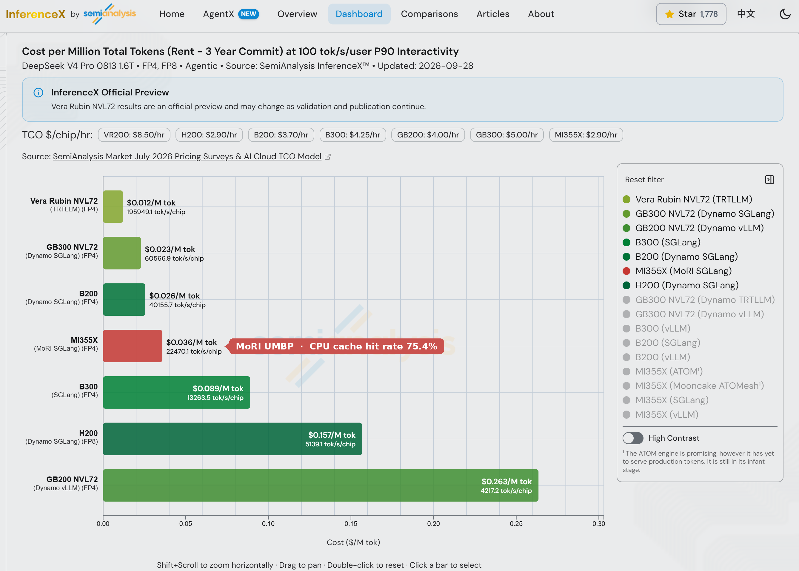
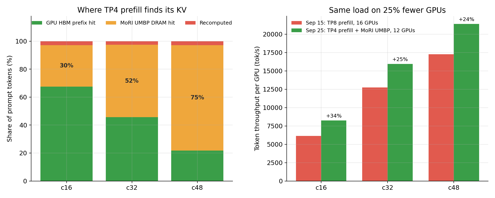
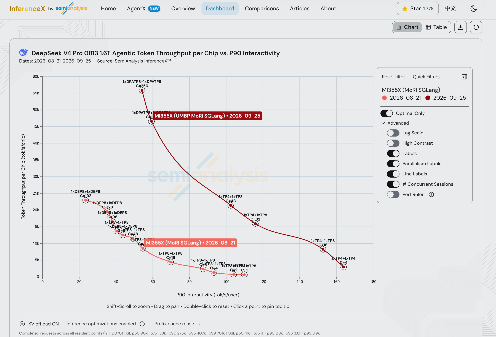
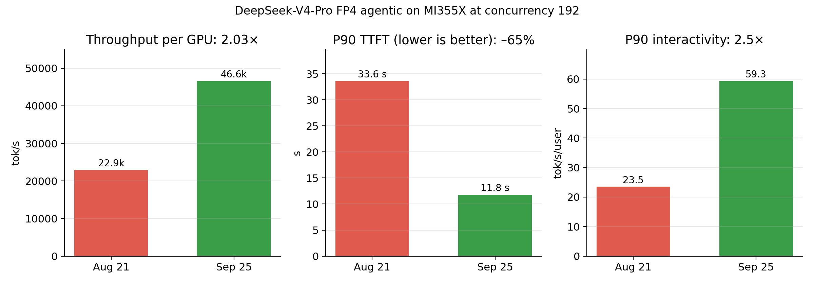

# MoRI UMBP Empowers AMD Instinct™ MI355X to Demonstrate Token-per-Dollar TCO Leadership on the Public AgentX Leaderboard

*September 2026*

Agentic applications run long multi-turn sessions, which makes the cost of serving them depend overwhelmingly on how much KV cache the server can reuse instead of recomputing.

In July, together with Moonshot AI, we introduced **MoRI UMBP** (Unified Memory & Bandwidth Pool) in [*Rebuilding Agentic AI from First Principles for AMD GPU*](https://www.amd.com/en/developer/resources/technical-articles/2026/rebuilding-agentic-ai-for-amd-gpu.html). MoRI UMBP is a KV cache infrastructure built by the AMD MoRI team from first principles, starting from the agentic workload itself and purpose-built for the AMD platform. Over the past month we have contributed that work to the SGLang community, where it lands in the open-source ecosystem as the backend behind the new KVCache Store Linker, so the whole community benefits. On the public SemiAnalysis AgentX benchmark with DeepSeek-V4-Pro-0813 1.6T, AMD MI355X — running MoRI disaggregation with MoRI UMBP as the unified KV cache pool, on top of AMD's ongoing optimization work in the SGLang community — now **outperforms NVIDIA B300 and GB200 NVL72 at the same per-user speed**: at 100 tok/s/user P90 interactivity it delivers **1.7× and 5.3× their throughput per chip, and 2.5× and 7.3× their tokens per dollar**. At its peak it delivers **69M total tokens per $1 TCO, against 46M for B200 running Dynamo SGLang: a 1.5× advantage in tokens per dollar** (SemiAnalysis Rent / 3-Year-Commit cost tier, B200 at $3.7/chip/hr and MI355X at $2.9/chip/hr, as of 2026-09-25).

*Figure 1: DeepSeek-V4-Pro-0813 1.6T agentic total tokens per $1 TCO vs. P90 interactivity, from the public SemiAnalysis InferenceX dashboard (Rent / 3-Year-Commit tier, updated 2026-09-25). Red is MI355X FP4 with MoRI UMBP + MoRI + SGLang; the green curves are the NVIDIA field — B200, B300, H200, GB200 and GB300 NVL72, plus a Vera Rubin NVL72 preview. Up and to the right is better; labels show the parallelism layout of each point.*

*Figure 2: Cost per million total tokens (Rent / 3-Year-Commit tier) at 100 tok/s/user P90 interactivity, DeepSeek-V4-Pro-0813 1.6T agentic, from the public SemiAnalysis InferenceX dashboard (updated 2026-09-28). Shorter bars are cheaper; the figure under each price is the throughput per chip at that interactivity.*

The rest of this post covers in detail how MoRI UMBP produces that result.

## A Quick Recap of the Public AgentX Benchmark

AgentX is a public benchmark built by SemiAnalysis from real-world agentic coding traces, served through the public InferenceX harness and dashboard. It is fast becoming an industry standard for agentic inference evaluation, adopted worldwide by leading teams including OpenAI, Meta, Inferact, RadixArk, MiniMax, Alibaba Qwen, Moonshot AI, Zhipu GLM and Oracle. Its methodology, results and CI are all public, so **every number in this post can be checked independently, including by NVIDIA.**

AgentX replays whole agent sessions: each turn appends tool results to the accumulated context and re-queries the model. That traffic has four properties chat benchmarks do not produce.

- **Long-running, multi-turn sessions** — roughly 43 turns per session, around 1M tokens of context traffic over a session's life.
- **Long contexts, short outputs** — median 142K input tokens against 444 output tokens per turn.
- **Extensive prefix reuse** — above 96% of prompt tokens are repeats of a prefix the server has already seen.
- **Subagents and tool calls**, which fan a single user task out into several concurrent sessions sharing a prefix.

It reports TTFT, P90 interactivity (per-user tok/s), TPGS (total tokens per GPU-second, counting cached tokens), and TCO (infrastructure cost per token) — the last of which is what Figure 1 plots.

At 96% prefix reuse, *cache management determines prefill cost*. And because the agent blocks on the full response, the latency that matters is end-to-end, dominated by decode. AgentX therefore presents three challenges we had to solve:

- **The KV cache does not fit in HBM.** With many long sessions live at once and subagents fanning out, most reusable KV has already been evicted from GPU memory at moderate concurrency.
- **The KV cache is not sharded across TP ranks.** Under DeepSeek-V4 sparse attention, the MLA latent and DSA indexer KV are replicated in full on every rank.
- **Cache warmth is not free.** A host cache that lives inside the engine process is lost on every restart, and on every rolling upgrade.

## MoRI UMBP + the SGLang KVCache Store Linker

To address those challenges we went back over the problems MoRI UMBP had been hitting. MoRI UMBP was integrated into SGLang as a **HiCache L3 storage backend**, and on AgentX we made the following observations:

- **Wasted shareable DRAM.** Unsharable HiCache occupies DRAM that could otherwise serve the shareable L3 backend, shrinking effective shareable capacity.
- **Indirect data path.** Sitting between L1 HBM and the L3 backend, HiCache adds load/offload overhead and blocks a direct L1 ⇔ L3 data path.
- **Per-rank local management.** HiCache is embedded per rank and makes all KV decisions on local information only, which is globally suboptimal.
- **Redundant replication.** Under MLA + TP, each TP rank replicates the KV cache and loads/offloads independently, wasting memory and PCIe bandwidth.
- **No layer-wise pipelining.** HiCache overlaps its L2→L1 load layer by layer, but the fetch from the external L3 backend into L2 is not pipelined — it must complete before compute starts.
- **Cache dies with the engine.** HiCache lives in the engine process, so any restart discards the host-side cache.

### The KVCache Store Linker

We proposed to the SGLang maintainers an option to bypass HiCache entirely with a direct data path between L1 HBM and external KV cache stores — a direction that turned out to align closely with the community's own plans. The MoRI team then co-designed the **KVCache Store Linker** with the SGLang community, integrating MoRI UMBP as a first-class backend. The linker connects SGLang's unified radix tree straight to the distributed DRAM pool. On a prefix match, prefill pulls KV pages from DRAM instead of recomputing them.

Linker + MoRI UMBP resolves all six issues above:

- **Fully shareable DRAM** across DP ranks and model instances — enabling DP + round-robin deployments via cross-DP-rank KV cache sharing.
- **Direct L1 ⇔ L3 path** with no intermediate overhead, improving TTFT by up to 13% over the HiCache path on its own.
- **Global KV management** — MoRI UMBP places and evicts KV based on global information, more effective than per-rank local policies.
- **Deduplication + split load/offload by rank**, alleviating memory and PCIe bandwidth pressure. A TP-N prefill now stores and fetches one copy of the replicated MLA/DSA KV instead of N; at TP8, eight keys become one. That multiplies effective DRAM capacity and cuts host traffic by the same factor.
- **Layer-wise pipelined loading**, with MoRI UMBP hiding the added per-layer request overhead via batching, layer grouping, a ranged API, and an optimized GPU gather kernel for host-to-device KV loading.
- **Cache survives engine restarts** — in MoRI UMBP standalone mode the KV pool lives in a separate per-node process, so restarts and upgrades reuse it with no warm-up.

### Results

Replacing HiCache with the MoRI UMBP linker, measured end-to-end on the AgentX agentic-coding scenario:

| Concurrency | Throughput/GPU | P90 TTFT |
|---|---|---|
| 192 | **+14%** | **–66%** (35.3 s → 11.9 s) |
| 256 | +9.7% | –51% |

The TTFT reduction comes from eliminating prefix recomputation on a workload with 96% prefix reuse. No kernel changed.

**A large enough cache changes the topology.** Once the deduplicated DRAM tier is in place, prefill no longer needs TP8 simply to hold KV. At concurrency 16–48 we run a **TP4 prefill with a TP8 decode (12 GPUs)** instead of TP8 + TP8 (16 GPUs). MoRI UMBP serves 30%, 52% and 75% of prompt tokens at concurrency 16, 32 and 48, while less than 3% are recomputed. Throughput per GPU rises 24–34% on 25% fewer GPUs — and the leads over NVIDIA at 100 tok/s/user cited in the introduction rest on these TP4-prefill points.

*Figure 3: Left: where the TP4 prefill finds the KV for each prompt token under the MoRI UMBP linker — GPU HBM prefix cache, MoRI UMBP DRAM tier, or recomputation. As concurrency grows and HBM evicts more, the DRAM tier absorbs the difference. Right: throughput per GPU of the [Sep 15 recipe](https://github.com/SemiAnalysisAI/InferenceX/actions/runs/34926284365) (TP8 prefill + TP8 decode, 16 GPUs) vs. the Sep 25 recipe (TP4 prefill + MoRI UMBP + TP8 decode, 12 GPUs). The Sep 25 arms also include optimistic prefill and the SGLang v0.5.20 image; concurrency 16 additionally uses DSpark block size=6.*

The trade-off is prefill time. With half the prefill GPUs, P90 TTFT at concurrency 16–48 rises by 26–53% (2.2–3.6 s → 2.7–5.6 s). For agentic workloads, where the agent waits for the full response and TTFT is a small fraction of it, we take that trade for more throughput per GPU at a fixed per-user decode speed.

## Further Optimizations

Alongside this, the AMD SGLang team continues to deliver optimizations for DeepSeek-V4-Pro, covering the following areas.

- **FP4 sparse-attention indexer** . DeepSeek-V4's DSA indexer scores the whole context for every query token at every layer, and carries its own per-token KV. Running it on AITER FP4 kernels on gfx950 cuts that KV from **132 B to 68 B per token** — more concurrent sequences in HBM, less indexer bandwidth per decode step, and fewer bytes over the MoRI link.
- **Optimistic prefill with request-owned speculative KV** . In PD disaggregation a request normally waits for decode to bootstrap it before prefill can start; at high concurrency that handshake is pure queueing time. Letting prefill start optimistically, with the speculative KV owned by the request rather than a pre-reserved decode slot, cut **P90 TTFT by 27.7% at concurrency 256**. Removing a host sync from DSpark prefill slot expansion cut P90 TTFT a further **13–16%** at concurrency 128–256.
- **Per-stream split-K for MLA decode**  picks the split-K factor per index stream instead of applying one setting to layers whose KV lengths differ by orders of magnitude.

*Figure 4: Throughput per GPU vs. P90 interactivity across the optimization campaign. The Aug 21 baseline uses 16 GPUs (1P1D, TP8 + TP8) at every point; the optimized recipes pick 8, 12 or 16 GPUs per concurrency and report throughput normalized per GPU.*

## Summary

This work produced two results.

**First, against NVIDIA Blackwell systems.** On the public AgentX leaderboard, at the same per-user speed, MI355X beats B300 and GB200 NVL72 on both throughput per chip and tokens per dollar (Figure 2).

**Second, against ourselves a month earlier.** On the same benchmark at the same concurrency of 192, throughput, TTFT and interactivity all improved substantially (Figure 5).

*Figure 5: MI355X at concurrency 192, [Aug 21 baseline](https://github.com/SemiAnalysisAI/InferenceX/actions/runs/32269076444/attempts/4) vs. [Sep 25 run](https://github.com/SemiAnalysisAI/InferenceX/actions/runs/35879254139/attempts/1). Left to right: throughput per GPU, P90 TTFT (lower is better) and P90 interactivity.*

Peak throughput per GPU also rose from 22.9k to 55.8k (**2.4×**), at concurrency 256.

In an agentic workload, 96% of prompt tokens have already been computed, so the cost per token is set by the system that manages where those tokens live. MoRI UMBP is that system: it turns DRAM into a deduplicated KV pool that is shareable across instances and survives engine restarts, wired straight into SGLang's radix tree through the KVCache Store Linker.

The first item on the July roadmap was completing the MoRI UMBP integration; that is now delivered. The next is bringing MoRI UMBP to the broader ecosystem e.g. ATOM, vLLM, llm-d.

## Acknowledgements

We thank the SGLang community for design reviews and fast upstreaming, SemiAnalysis for the AgentX benchmark and InferenceX CI infrastructure, and the AMD MoRI, SGLang, and AITER teams.

## References

1. SemiAnalysis — AgentX benchmark and InferenceX dashboard. https://inferencex.semianalysis.com
2. vLLM — AgentX. https://vllm.ai/blog/2026-09-08-vllm-agentx
3. AMD — Rebuilding Agentic AI from First Principles for AMD GPU, together with Moonshot AI ("What is UMBP"). https://www.amd.com/en/developer/resources/technical-articles/2026/rebuilding-agentic-ai-for-amd-gpu.html
